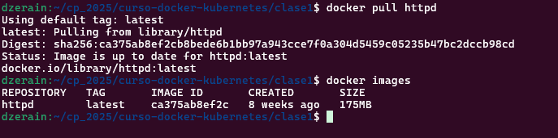
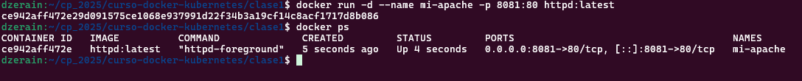
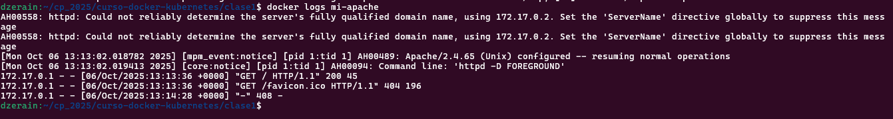
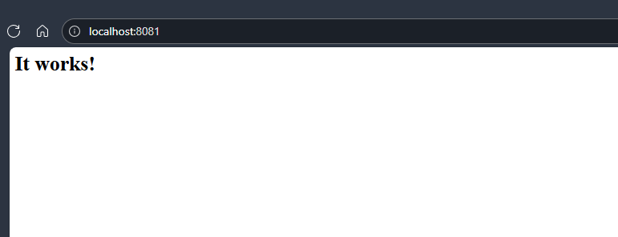
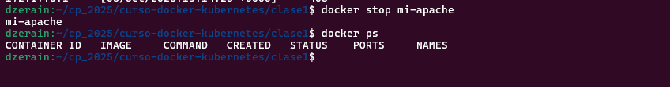
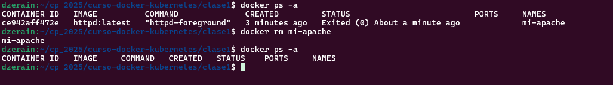
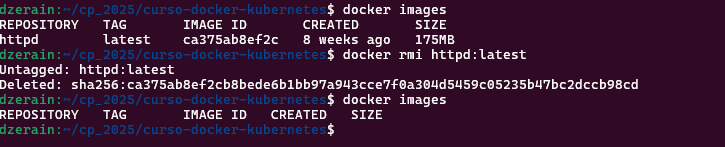

# Tarea 1 - Configuración de Repositorio y Primer Desafío

## Despliegue de  Apache HTTP Server (httpd)

### Comandos Ejecutados
```docker pull httpd```

Comando que se ejecuto para obtener la imagen de httpd desde docker hub



```docker run -d --name mi-apache -p 8081:80 httpd:latest```

Comando que se ejecuto para correr el contenedor

```docker ps```

Comando para verificar que se encuentre corriendo



```docker logs mi-apache```

Comando para ver los logs del contenedor





```docker stop mi-apache```

Comando para detener el contenedor

```docker ps -a```

Comando para ver todos los cotenedores incluidos los que no se encuentran corriendo



```docker rm mi-apache```

Comando para eliminar el contenedor mi-apache



```docker images```

Comando para ver las imagenes descargadas

```docker rmi httpd:latest```

Comando para eliminar la imagen httpd:latest


