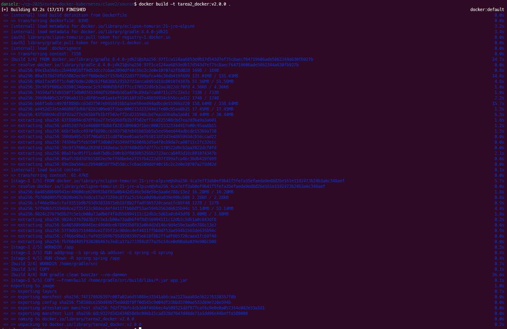
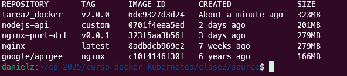
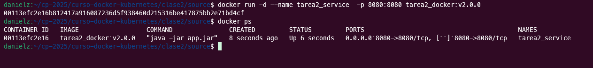
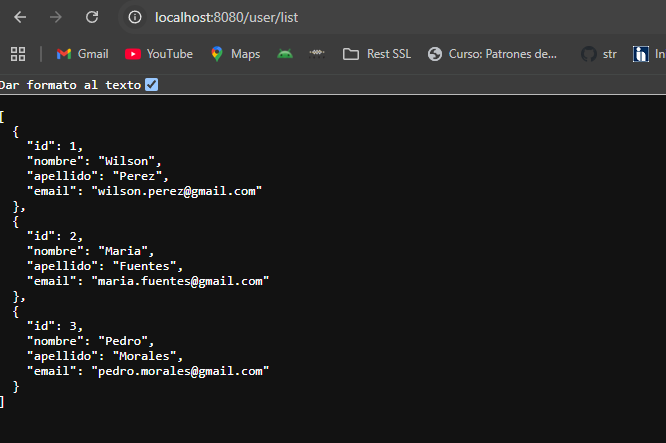
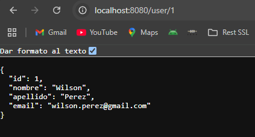
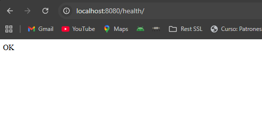
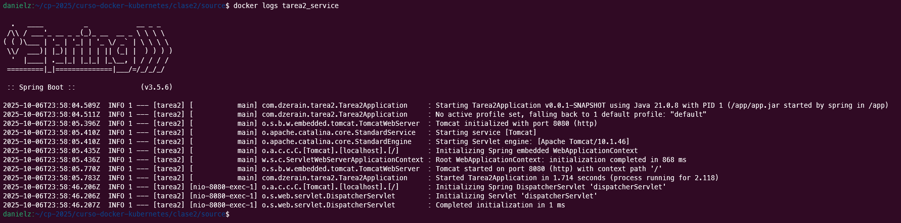
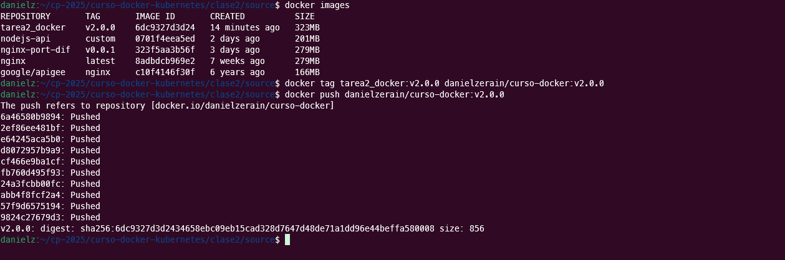
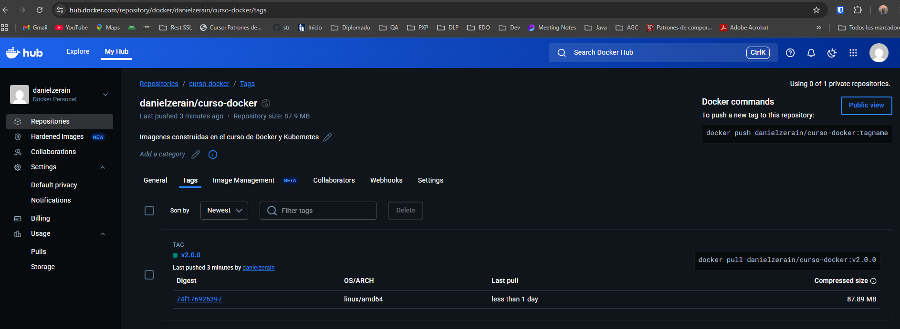
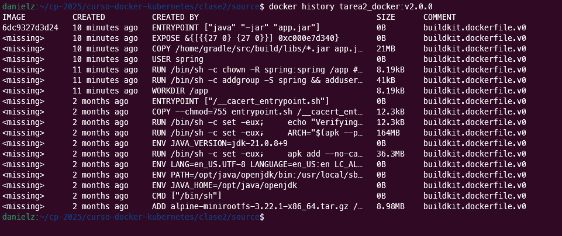

# Tarea 2 - Dockerizar Aplicación con Multi-Stage Build

## Parte 1: Elegir o Crear una Aplicación

Se crea una aplicacion para la gestion de personal,listando los usuarios y el detalle de cada uno. Se desarrollo con **Java 21** y **SpringBoot v.3.5.6** y el build seleccionado es **Gradle**, el codigo fuente se encuentra en el repositorio ...

[Codigo Fuente](source/) 

### Endpoints disponibles ###
Se cuentan con tres endpoints disponibles

#### Endpoint: Listar Usuarios ####
http://localhost:8080/user/list

#### Endpoint: Detalle de Usuario ####
http://localhost:8080/user/1

#### Endpoint: Servicio Health Check ####
http://localhost:8080/health/


## Parte 2: Crear Dockerfile con Multi-Stage Build

El siguiente es el Dockerfile se utiliza dos Stage: **Build Stage** y **Runtime Stage**

```dockerfile
# =====================================================================================
# ETAPA 1: Construcción (Build Stage)
# =====================================================================================
FROM gradle:8.4.0-jdk21 AS build

WORKDIR /home/gradle/src

#Copia del código fuente
COPY . .

#compilación y empaquetado de la aplicación
RUN gradle clean bootJar --no-daemon

# =====================================================================================
# ETAPA 2: Ejecución (Runtime Stage)
# =====================================================================================
FROM eclipse-temurin:21-jre-alpine

# Establecer el directorio de trabajo
WORKDIR /app

# Crear un usuario no root para ejecutar la aplicación
RUN addgroup -S spring && adduser -S spring -G spring

# Cambiar la propiedad del directorio de trabajo al usuario no root
RUN chown -R spring:spring /app

# Cambiar al usuario no root
USER spring

# Copiar el archivo JAR desde la etapa de construcción
COPY --from=build /home/gradle/src/build/libs/*.jar app.jar

# Exponer el puerto en el que la aplicación escuchará
EXPOSE 8080

# Comando para ejecutar la aplicación
ENTRYPOINT ["java", "-jar", "app.jar"]
```

## Parte 3: Build ##

### Construccion de la Imagen ###

`docker build -t tarea2_docker:v2.0.0 .`



`docker images`



## Parte 4: Testing Local ##

### Ejecucion del Contenedor ###

`docker run -d --name tarea2_service  -p 8080:8080 tarea2_docker:v2.0.0`



### Navegacion de Endpoints ###

#### Endpoint: Listar Usuarios ####

http://localhost:8080/user/list



#### Endpoint: Detalle de Usuario ####

http://localhost:8080/user/1



#### Endpoint: Servicio Health Check ####
http://localhost:8080/health/



### LOGS del Contenedor ###

` docker logs tarea2_service`




## Parte 5: Publicar en Docker Hub ##

Se establece el tag de la imagen con el repositorio de docker hub

`docker tag tarea2_docker:v2.0.0 danielzerain/curso-docker:v2.0.0`

Se publica la imagen en Docker Hub

`docker push danielzerain/curso-docker:v2.0.0`



Imagen ya publicada



La url de la imagen es 

```
danielzerain/curso-docker:v2.0.0
```

## Parte 6: Optimizaciones Aplicadas ##

- Multistage

Se construyo la imagen con dos stages uno de construccion (Build Stage) y otro de ejecucion (Runtime Stage)

- Imagenes optimizadas

Para la ejecucion se utilzo una imagen alpine optimizando el tamaño

`docker history tarea2_docker:v2.0.0`



## Parte 7: Conclusiones ##

En esta practica se aprendio:

- Optimizacion en la construccion de imagenes utilizando multistage
- Seguridad de las imagenes de construccion