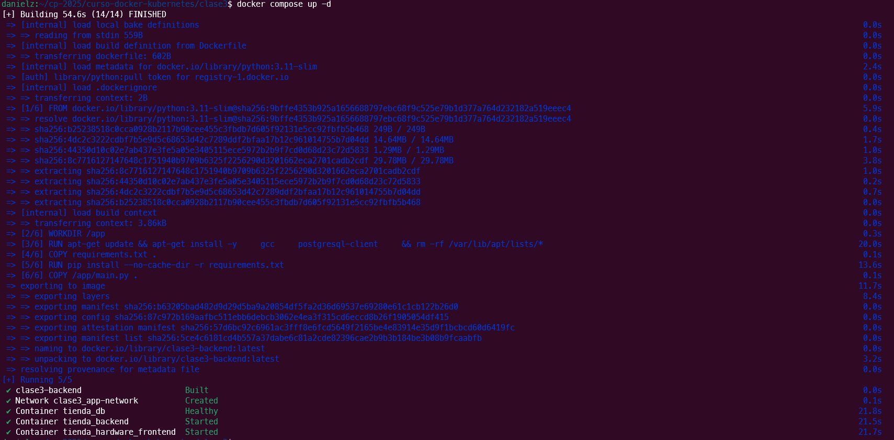
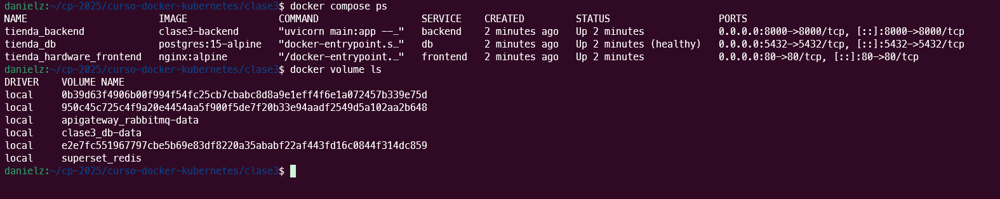
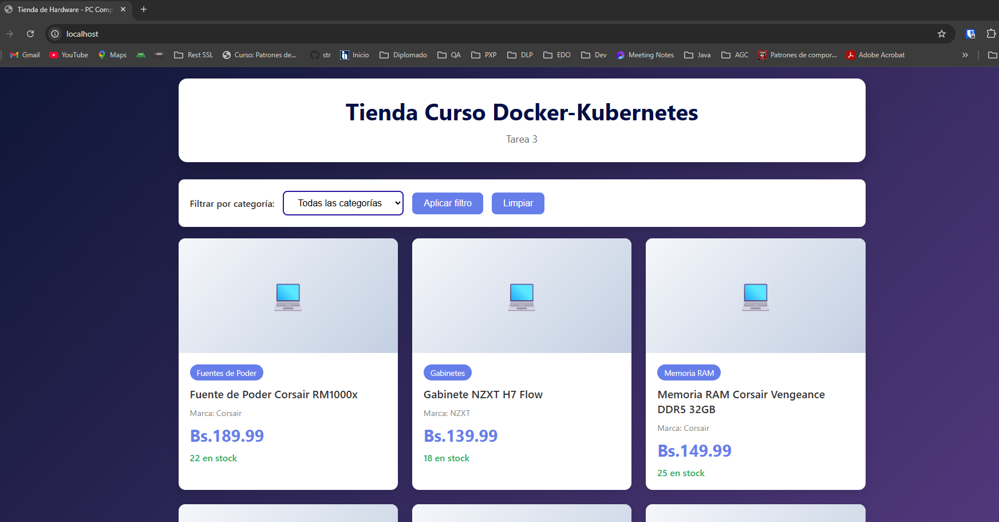
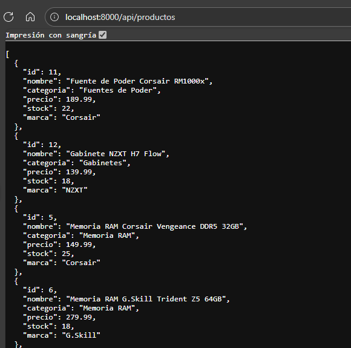
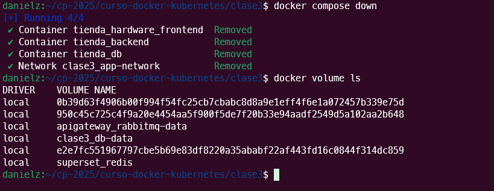
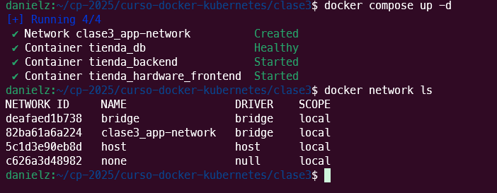
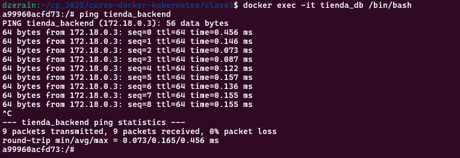

# Tarea 3 - Aplicación Multi-Contenedor con Docker Compose

# Tienda Virtual de Hardware

**Curso:** Docker & Kubernetes - Clase 3

**Estudiante:** Daniel Zerain

La aplicacion lista los componentes de hardware detallando sus caracteristicas, precios y cantidad en stock

* Nota: *Se versiono el archivo .env solo para fines de pruebas* 

## Stack

- **App:** Python

- **Base de datos:** PostgreSQL

- **Front :** HTML, Javascript desplegado en nginx

## Ejecución
1. Clonar el proyecto:
   ```bash
   git clone https://github.com/danielzerain/curso-docker-kubernetes.git
   cd curso-docker-kubernetes/clase3

2. Levantar servicios:
   ```bash
   docker compose up -d



3. Acceder a la aplicacion:
   - API: http://localhost:8000
   - WEB: http://localhost

4. Pruebas:

## Verificación

1. Servicios corriendo:
   ```bash
   docker compose ps



2. Acceder a la pagina web: http://localhost



2. Acceder a los servicios: http://localhost:8000/api/productos



3. Verificacion de Volumenes persistentes:

   ```bash
   docker compose down
   ```



   ```bash
   docker compose up -d

   docker volume ls 
   ```


3. Verificacion de Red:

   ```bash
   docker network ls
   ```


   ```bash
   docker exec -it tienda_db /bin/bash
   ```

