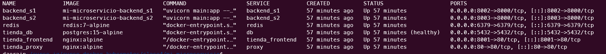
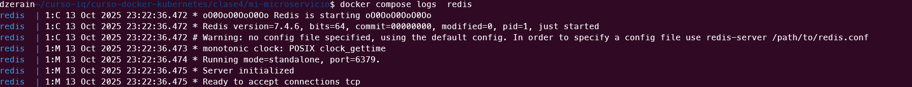
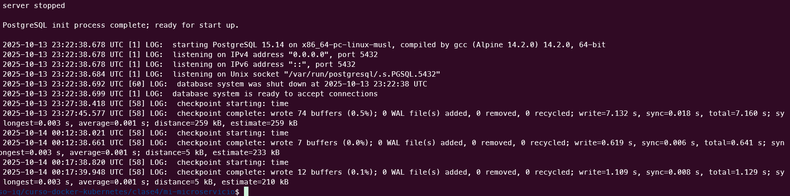
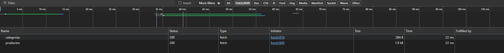
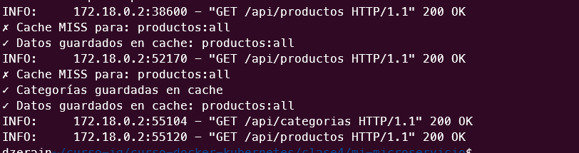
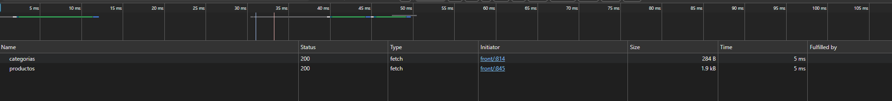
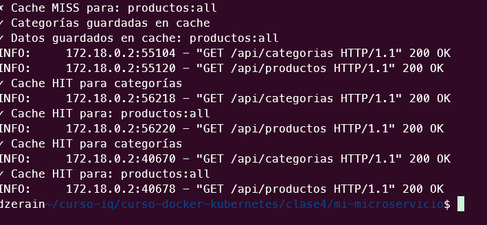
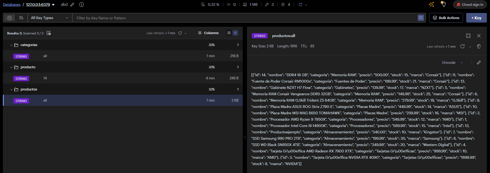

# Tarea 4 - Microservicios, Cache y API Gateway

# Tienda Virtual de Hardware

**Curso:** Docker & Kubernetes - Clase 4

**Estudiante:** Daniel Zerain

La aplicacion lista los componentes de hardware detallando sus caracteristicas, precios y cantidad en stock, permite la adicion de productos y la compra con un carrito de compras

* Nota: *Se versiono el archivo .env solo para fines de pruebas* 

## Stack

- **App:** Python

- **Base de datos:** PostgreSQL

- **Front :** HTML, Javascript desplegado en nginx


## 1. Arquitectura

```
┌────────────────────────────────────────────────────────────────────────────────────────────────────────────┐
│                                                                                                            │
│                                             ┌──────────────────┐                                           │
│                                             │                  │                                           │
│                                             │                  │                                           │
│                                    ┌────────►   Redis Cache    ┼──────┐                                    │
│                                    │        │                  │      │                                    │
│                                    │        │                  │      │                                    │
│                                    │        └──────────────────┘      │                                    │
│                                    │                                  │                                    │
│                                    │                                  │                                    │
│                          ┌─────────┼──────────┐             ┌─────────▼──────┐       ┌──────────────────┐  │
│                          │                    │             │                │       │                  │  │
│    ┌──────────────┐      │                    │             │                │       │                  │  │
│    │              │   ┌──► Service: Product   │             │ Postgresql     │       │  db-data         │  │
│    │              │   │  │python,fastapi,     ┼─────────────► Database       ┼──────►│  (Volume)        │  │
│    │              │   │  │ client-redis       │             │                │       │                  │  │
│    │              ┼───┘  │                    │             │                │       │                  │  │
│    │ Proxyte      │      └────────────────────┘             └────────▲─ ─────┘       └──────────────────┘  │
│    │              │                                                  │                                     │
│    │ Nginx        │      ┌────────────────────┐                      │                                     │
│    │              │      │                    │                      │                                     │
│    └─────┬┬───────┘      │                    │                      │                                     │
│          ││              │ Service: Cart      │                      │                                     │
│          │└──────────────► python,fastapi     │                      │                                     │
│          │               │                    ├──────────────────────┘                                     │
│          │               │                    │                                                            │
│          │               └────────────────────┘                                                            │
│          │                                                                                                 │
│          │               ┌────────────────────┐                                                            │
│          │               │                    │                                                            │
│          │               │ Front              │                                                            │
│          │               │ (Html+ jsvascript) │                                                            │
│          └───────────────►                    │                                                            │
│                          │ Nginx              │                                                            │
│                          │                    │                                                            │
│                          └────────────────────┘                                                            │
│                                                                                                            │
└────────────────────────────────────────────────────────────────────────────────────────────────────────────┘
```

## 2. Servicios

| Servicio | Tecnología | Puerto | Descripción |
|----------|------------|--------|-------------|
| tienda_proxy | Nginx | 8000 | API Gateway |
| backend_s2 | Python | 8002 | API Producto |
| backend_s2 | Python | 8002 | API Compras |
| redis | Redis | 6379 | Cache |
| tienda_db | Postgresql | 5432 | Base de datos |
| frontend | Nginx | 80 | Interfaz web |

3. Ejecución

```bash

1. Clonar el proyecto:
   
   git clone https://github.com/danielzerain/curso-docker-kubernetes.git
   cd curso-docker-kubernetes/clase4/mi-microservicio

2. Levantar servicios:
   
   docker compose up -d

3. Verificar Estado:

   docker compose ps

4. Ver los logs en tiempo real:

   docker compose logs -f

5. Acceso a la aplicacion

   http://localhost/front/

```

***Contenedores*** 



***Logs***

**Redis**



**Postgresql**



4. Endpoints de la API

```
GET /api/categorias
Descripción: Lista todas las caracteristica
Response: {
    "categorias": [
        "Almacenamiento",
        "Fuentes de Poder",
        "Gabinetes",
        "Memoria RAM",
        "Placas Madre",
        "Procesadores",
        "Tarjetas Gráficas"
    ]
}
```

```
GET /api/productos
Descripción: Lista todos los productos
Response: {
     {
        "id": 11,
        "nombre": "Fuente de Poder Corsair RM1000x",
        "categoria": "Fuentes de Poder",
        "precio": 189.99,
        "stock": 22,
        "marca": "Corsair"
    }
}
```

### Sin Cache





### Con Cache






```
POST /api/productos
Descripción: Registra un producto
Request: {"nombre":"DDR4 16 GB","categoria":"Memoria RAM","marca":"Corsair","precio":500,"stock":15,"descripcion":"Memoria 2.6","imagen_url":null}
Response: {"success":true,"message":"Producto registrado exitosamente","producto_id":14}
```

```
POST /cart/pedidos
Descripción: Registra un Pedido
Request: {"cliente_nombre":"Daniel Z","cliente_email":"daniel.z@outlook.com","items":[{"producto_id":11,"cantidad":1}]}
Response: {
    "success": true,
    "message": "Pedido creado exitosamente",
    "pedido_id": 2,
    "total": 189.99
}
```

### Consola de Redis

