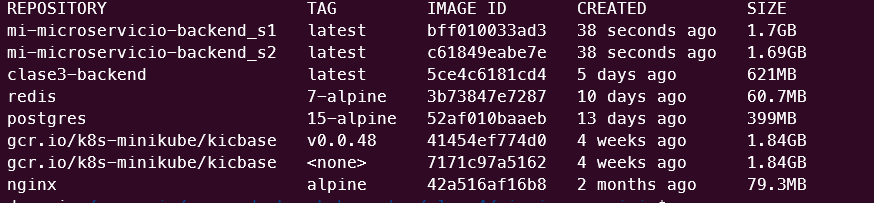
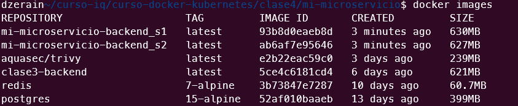
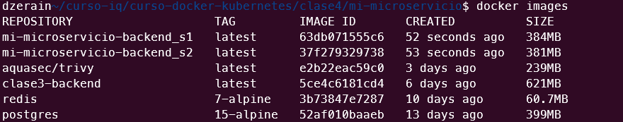
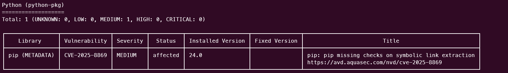

# Tarea 5 - Seguridad y Optimizacion

# 1. Tienda Virtual de Hardware

**Curso:** Docker & Kubernetes - Clase 4

**Estudiante:** Daniel Zerain

La aplicacion lista los componentes de hardware detallando sus caracteristicas, precios y cantidad en stock, permite la adicion de productos y la compra con un carrito de compras

* Nota: *Se versiono el archivo .env solo para fines de pruebas* 

## 2. Stack 

- **App:** Python

- **Base de datos:** PostgreSQL

- **Front :** HTML, Javascript desplegado en nginx

- **Seguridad Imagenes Docker:** Trivy 

## 3. Mejoras Aplicadas

### Cambio de imagen base

```dockerfile
# Sin Optimizacion
FROM python:3.11-slim

WORKDIR /app

RUN apt-get update && apt-get install -y \
    gcc \
    postgresql-client \
    && rm -rf /var/lib/apt/lists/*
# ... resto de configuración

# Optimizada
FROM python:3.13-alpine

# Establecer directorio de trabajo del servicio 1
WORKDIR /app

# Instalar dependencias del sistema
RUN apk update && apk add --no-cache \
    gcc \
    libpq \
    && adduser -D -u 1000 appuser
# ... resto de configuración
```
** Se reduce el tamano de la imagen, se realizaron pruebas con imagen Base, Slim y Alpine

** Base



** Slim



** Alpine




### Usuario Non-Root

```dockerfile
RUN apk update && apk add --no-cache \
    gcc \
    libpq \
    && adduser -D -u 1000 appuser

COPY requirements.txt .

RUN pip install --no-cache-dir -r requirements.txt

COPY main.py .

# Cambiar a usuario no root
USER appuser
```


### Health Check

```dockerfile
HEALTHCHECK --interval=30s --timeout=3s \
  CMD node -e "require('http').get('http://localhost:8000/cart/health', (r) => process.exit(r.statusCode === 200 ? 0 : 1))"
```

### Labels de Seguridad

```dockerfile
LABEL maintainer="daniel.zerin" \
      version="1.0-optimizado" \
      description="Servicio de Pedidos" \
      security.scan="trivy" \
      security.non-root="true"
```

## Tabla Comparativa

| Métrica | Baseline | Optimizado | Mejora |
|---------|----------|------------|--------|
| Tamaño imagen | 1.7GB | 384MB | -77% |
| Vulnerabilidades CRITICAL | 1 | 1 | 0% |
| Vulnerabilidades HIGH | 12 | 3 | -75% |
| Usuario | root | appuser | ✓ |
| Multi-stage | ✗ | ✗ | ✗ |
| Health check | ✗ | ✓ | ✓ |

## Análisis de Vulnerabilidades

Se acttualizo la version de la imagen de la 11 a la 13 y 1 vulnerabilidad MEDIUM se presenta en ambas versiones

### python:3.11-slim


### python:3.13-alpine


```markdown
## Seguridad Mejorada

- [x] Escaneo con Trivy (0 CRITICAL)
- [x] Usuario non-root verificado
- [-] Multi-stage build implementado
- [x] Imagen base alpine utilizada
- [x] Health check funcional
- [x] Labels de metadata agregados
- [x] .dockerignore configurado
- [x] Sin secretos hardcoded en código
```