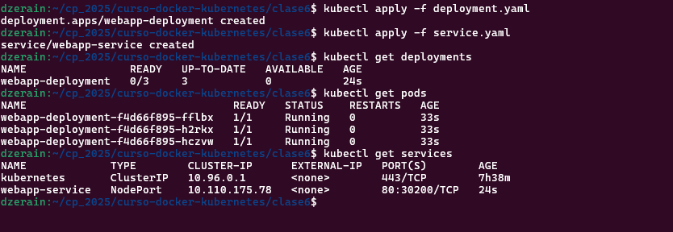
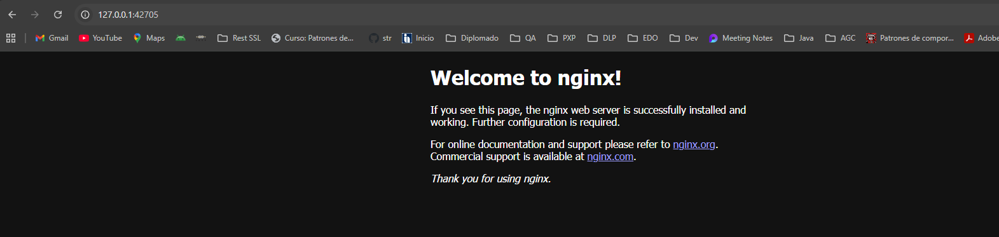
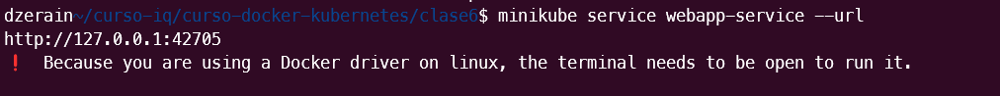
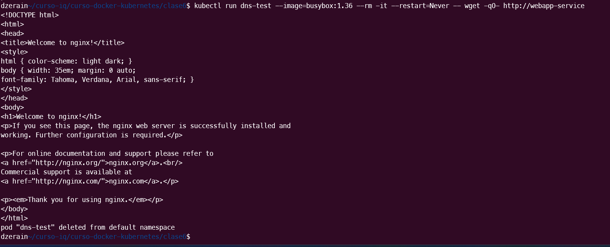
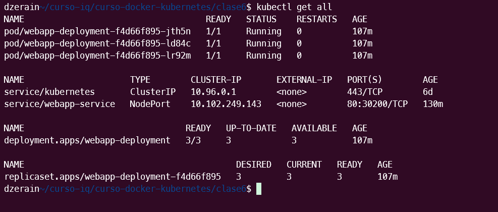
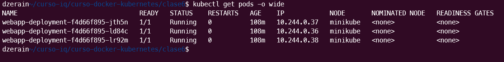
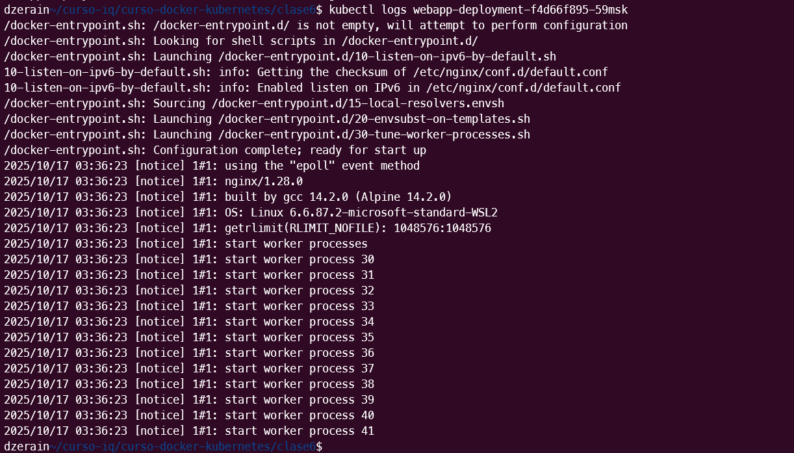
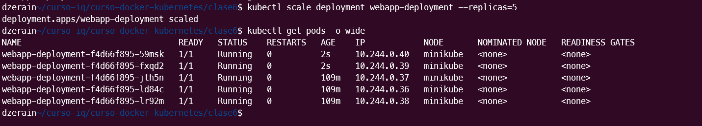
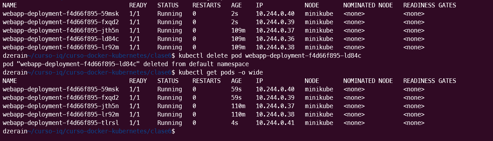

# Servidor WEB-NGINX

**Curso:** Docker & Kubernetes - Clase 6
**Estudiante:** Daniel Zerain Medinaceli

Despliegue de servidor web NGINX con 3 replicas

## Stack

- **Aplicación:** Nginx 
- **Kubernetes:** minikube
- **Réplicas:** 3


## Ejecución

1. Clonar:
   ```bash
   git clone https://github.com/danielzerain/curso-docker-kubernetes.git
   
   cd curso-docker-kubernetes/clase6
   ```

2. Desplegar:
   ```bash
   kubectl apply -f deployment.yaml

   kubectl apply -f service.yaml
   ```




3. Acceder:
   ```bash
   minikube service webapp-service --url
   ```




O se accede mediante busybox

   ```bash
   kubectl run dns-test --image=busybox:1.36 --rm -it --restart=Never -- wget -qO- http://webapp-service
   ```



4. Ver todos los recursos:
   ```bash
   kubectl get all
   ```



5. Ver todos los pods:
   ```bash
   kubectl get pods -o wide
   ```


5. Ver todos los logs de un pod:
   ```bash
   kubectl logs  ***nombre del pod***
   ```



## Escalamiento

Para escalar se ejecuta el siguiente comando:
   ```bash
   kubectl scale deployment webapp-deployment --replica=5
   ```




## Auto-healing

Se detiene un pod para ver que kubernertes lo recupere
   ```bash
   kubectl delete pod ***nombre del pod***
   ```

Ver el estado de los pods para ver si recupero el pod

   ```bash
   kubectl get pods -o wide
   ```


