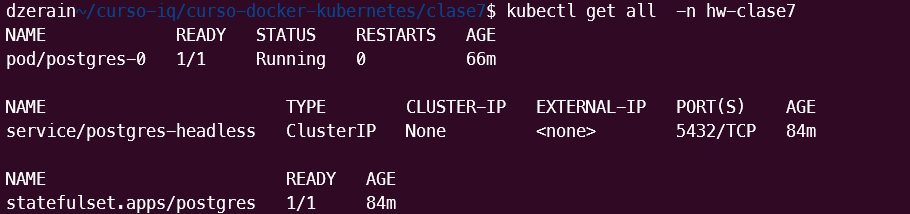

# Configuracion Persistencia

**Curso:** Docker & Kubernetes - Clase 7
**Estudiante:** Daniel Zerain Medinaceli

Conceptos aplicados (namespace, configmap, secret, statefulset, pvc)

## Instrucciones ##

1. Crear namespace

```bash
kubectl apply -f namespace.yaml
```

2. Aplicar ConfigMap
```bash
kubectl apply -f configmap.yaml
```

3. Aplicar Secret
```bash
 kubectl apply -f pg-secret.yaml
```

4. Aplicar Headless Service
```bash
kubectl apply -f   pg-service.yaml
```

5. Aplicar StatefulSet
```bash
kubectl apply -f  pg-statefulset.yaml
```

6. Verificar que todo está corriendo
```bash
kubectl get all -n hw-clase7
```


```bash
kubectl get all pvc hw-clase7
```


```bash
kubectl get configmap hw-clase7
```


```bash
kubectl get secret hw-clase7
```


7. Probar PostgreSQL
```bash
kubectl exec -it postgres-0 -- psql -U admin -d dbhw
```


8. Demostrar persistencia
```bash
kubectl delete pod postgres-0
```


9. Limpieza 

**Eliminar todos los recursos** 

```bash
kubectl delete pod postgres-0
```

