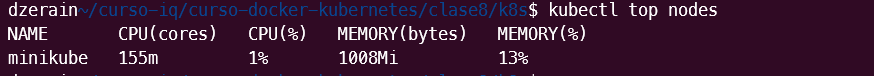
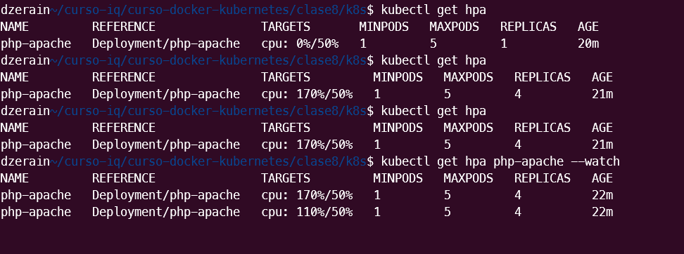
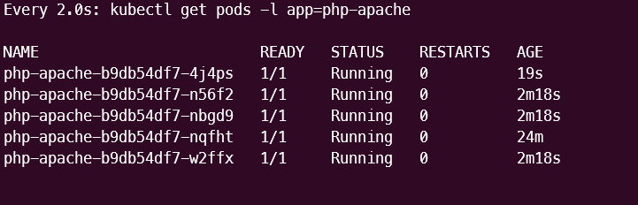

**a) Descripción del proyecto:**
- Stack desplegado (frontend + backend)
- Conceptos aplicados (Ingress, health probes, HPA)

**b) Instrucciones de despliegue:**
1. Habilitar addons (ingress, metrics-server)
```bash
minikube addons enable ingress
```
.png>)

2. Aplicar manifests
```bash
kubectl apply -f backend-deployment.yaml
kubectl apply -f frontend-deployment.yaml
kubectl apply -f  backend-service.yaml
kubectl apply -f  frontend-service.yaml
```
3. Verificar recursos
```bash
kubectl get all
```
.png>)

Verificacion de **Liveness**

```bash
kubectl describe pod
```
.png>)

4. Probar Ingress
```bash
kubectl apply -f ingress.yaml
kubectl get ingress
```
5. Probar HPA con carga
```bash
 minikube addons enable metrics-server
```
.png>)

```bash
 kubectl get pods -n kube-system | grep metrics-server

 kubectl top nodes
```

.png>)



```bash
 kubectl get pods -l app=php-apache

 ```

 ```bash
kubectl describe hpa php-apache
 ```
 .png>)

 Con carga

 


**Verificar carga**
 ```bash
watch kubectl get pods -l app=php-apache
 ```
 